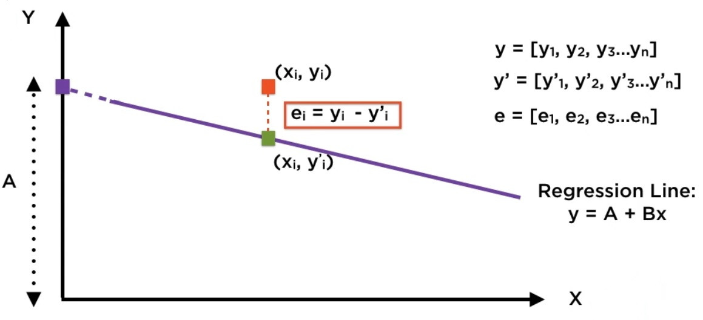
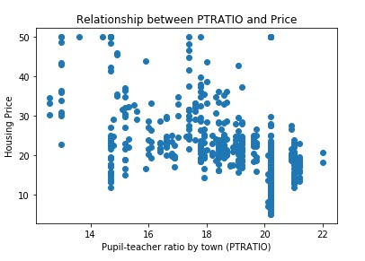
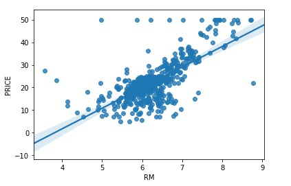

Regression is a way to fit a curve through a set of points.

It is used in quantifying cause-effect relationships and in forecasting.

#### Normal Probability Distribution:

Average is common.

Very high and very low are both unusual.

68% within 1 standard deviation of mean.

95% within 2 standard deviation of mean.

99% within 3 standard deviation of mean.

#### Linear Regression:
Finding the "best fit" line where the sum of the squares of the lengths of the errors is minimized.

y = A + Bx

We have some small errors called residuals:

y1 = A + B x1 + e1

y2 = A + B x2 + e2

y3 = A + B x3 + e3

...

yn = A + B xn + e1

Residuals of a regression are the difference between actual and fitted values of dependent variable.

To find the "best fit" line we need to make some assumptions about regression residuals. These assumptions are statistical properties that the residuals on a whole should satisfy.

Ideally, residuals should:

- have zero mean

- common variance

- be independent of each other

- be independent of independent variable

- be normally distributed

The zero mean, common variance and normally distributed, all occur when we have a normal distribution function.

Of the above three assumptions, the zero mean is always satisfied.

The common variance and normally distributed can be checked by inspecting the scatter plots.

Independence is hard to quantify, so we measure correlation instead. Correlation is a measure of linear similarity between two sets of numbers.
Zero correlation usually implies independence. The figure below shows a scatter plots for which we can say that the correlation is 0 i.e. Changes in PTRATIO independent of changes in PRICE.

A correlation of +1 is shown in figure below. Regression Line shows a high R-squared value.

#### Total Variance or Total Sum of Squares (TSS):
A measure of how volatile the dependent variable is.

#### Explained Variance or Explained Sum of Squares (ESS):
A measure of how volatile the fitted values are.

#### Residual Variance or Residual Sum of Squares (RSS):
Variance in the dependent variable that can't be explained by the regression.

TSS = ESS + RSS

#### R-squared:
The percentage of total variance explained by the regression. Usually, the higher the value of R-squared, the better the quality of the regression (Upper bound is 100%).

R-squared = ESS / TSS

R-squared tells us how much of the variation in one data series is caused by the variation in another data series. For example, if we have the following:

The stock of a company has risen 10% this year; the market is up 8% in the same period. 

Then R-squared helps us answer how much of the increase is explained by the market rise.

R-squared is one of the most used measures to check the model quality.

#### F-statistic:
Answers the question that does our regression as a whole 'adds value' at all.

High F-statistic => Yes

### Difference between F-statistic and T-statistics:
T-statistics tell us whether individual parameter coefficients are 'good' or not.
The higher the t-statistic of a coefficient, the higher our confidence in our estimate of that coefficient.

High T-statistic => Yes

F-statistic tells us whether an entire regression line is 'good' or not.

High F-statistic => Yes

Reference:

https://app.pluralsight.com/library/courses/understanding-applying-linear-regression/table-of-contents